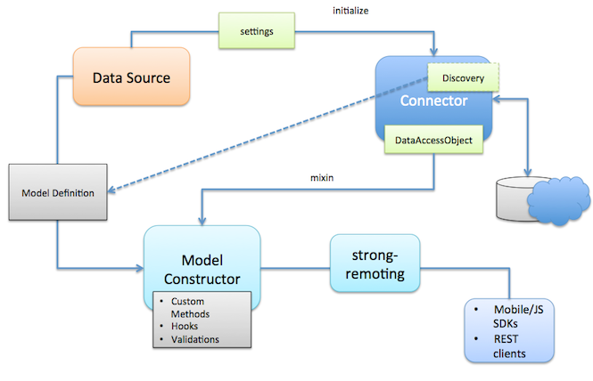

# LoopBack DataSource Juggler

LoopBack DataSource Juggler is an ORM that provides a common set of interfaces for interacting with databases, REST APIs, and other data sources.
It was initially forked from [JugglingDB](https://github.com/1602/jugglingdb).

## Overview

LoopBack DataSource Juggler consists of the following components:

* LoopBack Definition Language
* DataSource
* Connector

### LoopBack Definition Language

To define model dataSource have single method `dataSource.define`. It accepts three
arguments:

* **model name**:
  String name in camel-case with first upper-case letter. This name will be used
  later to access model.
* **properties**:
  Object with property type definitions. Key is property name, value is type
  definition. Type definition can be function representing type of property
  (String, Number, Date, Boolean), or object with {type: String|Number|...,
  index: true|false} format.
* **settings**:
  Object with model-wide settings such as `tableName` or so.

Examples of model definition:

    var User = dataSource.define('User', {
        email: String,
        password: String,
        birthDate: Date,
        activated: Boolean
    });

    var User = dataSource.define('User', {
        email: { type: String, limit: 150, index: true },
        password: { type: String, limit: 50 },
        birthDate: Date,
        registrationDate: {
            type: Date,
            default: function () { return new Date }
        },
        activated: { type: Boolean, default: false }
    }, {
        tableName: 'users'
    });

### DataSource

DataSource is a factory for model classes. DataSource connected with specific database or other
backend system using connector.

All model classes within single datasource shares same connector type and one database
connection. But it's possible to use more than one datasource to connect with
different databases.

#### Creating dataSource

`DataSource` constructor available on `loopback-datasource-juggler` module:

    var DataSource = require('loopback-datasource-juggler').DataSource;

DataSource constructor accepts two arguments. First argument is connector. It could be
connector name or connector package:

    var dataSourceByConnectorName = new DataSource('memory');
    var dataSourceByConnectorModule = new DataSource(require('redis'));

#### Settings

Second argument is optional settings. Settings object format and defaults
depends on specific connector, but common fields are:

* `host`: Database host
* `port`: Database port
* `username`: Username to connect to database
* `password`: Password to connect to database
* `database`: Database name
* `debug`: Turn on verbose mode to debug db queries and lifecycle

For connector-specific settings refer to connector's readme file.

#### Connecting to database

DataSource connecting to database automatically. Once connection established dataSource
object emit 'connected' event, and set `connected` flag to true, but it is not
necessary to wait for 'connected' event because all queries cached and executed
when dataSource emit 'connected' event.

To disconnect from database server call `dataSource.disconnect` method. This call
forwarded to connector if connector have ability to connect/disconnect.

#### DB structure syncronization

DataSource instance have two methods for updating db structure: automigrate and
autoupdate.

The `automigrate` method drop table (if exists) and create it again,
`autoupdate` method generates ALTER TABLE query. Both method accepts callback
called when migration/update done.

To check if any db changes required use `isActual` method. It accepts single
`callback` argument, which receive boolean value depending on db state: false if
db structure outdated, true when dataSource and db is in sync:

    dataSource.isActual(function(err, actual) {
        if (!actual) {
            dataSource.autoupdate();
        }
    });

## LoopBack Connectors

|    Type   | Package Name                                                                           |
| --------- |:--------------------------------------------------------------------------------------:|
| MongoDB   | [loopback-connector-mongodb](https://github.com/strongloop/loopback-connector-mongodb) |
| Oracle    | [loopback-connector-oracle](https://github.com/strongloop/loopback-connector-oracle)   |
| MySQL     | [loopback-connector-mysql](https://github.com/strongloop/loopback-connector-mysql)     |

## Build your own connector

LoopBack connectors provide access to backend systems including databases, REST APIs
and other services. Connectors are not used directly by application code. We create
a DataSource to interact with the connector.

For example,

    var DataSource = require('loopback-datasource-juggler').DataSource;
    var oracleConnector = require('loopback-connector-oracle');

    var ds = new DataSource(oracleConnector, {
        host : '166.78.158.45',
        database : 'XE',
        username : 'strongloop',
        password : 'str0ng100pjs',
        debug : true
    });

The connector argument passed the DataSource constructor can be one of the following:

* The connector module from `require(connectorName)`
* The full name of the connector module, such as 'loopback-connector-oracle'
* The short name of the connector module, such as 'oracle', which will be converted to 'loopback-connector-<shortName>'
* A local module under ./connectors/<connectorName> folder

## Generic connector implmentations

A connector module can implement the following methods to interact with the datasource.

    exports.initialize = function (dataSource, postInit) {

        var settings = dataSource.settings || {}; // The settings is passed in from the dataSource

        var connector = new MyConnector(settings); // Construct the connector instance
        dataSource.connector = connector; // Attach connector to dataSource
        connector.dataSource = dataSource; // Hold a reference to dataSource

        /**
         * Connector instance can have an optional property named as DataAccessObject that provides
         * static and prototype methods to be mixed into the model constructor. The property can be defined
         * on the prototype.
         */
        connector.DataAccessObject = function {};

        /**
         * Connector instance can have an optional function to be called to handle data model definitions.
         * The function can be defined on the prototype too.
         * @param model The name of the model
         * @param properties An object for property definitions keyed by propery names
         * @param settings An object for the model settings
         */
        connector.define = function(model, properties, settings) {
            ...
        };

        connector.connect(..., postInit); // Run some async code for initialization
        // process.nextTick(postInit);
    }

Another way is to directly export the connection function which takes a settings object.

    module.exports = function(settings) {
        ...
    }

## CRUD connector implmentations

To support CRUD operations for a model class that is attached to the dataSource/connector, the connector needs to provide
the following functions:

    /**
     * Create a new model instance
     */
    CRUDConnector.prototype.create = function (model, data, callback) {
    };

    /**
     * Save a model instance
     */
    CRUDConnector.prototype.save = function (model, data, callback) {
    };

    /**
     * Check if a model instance exists by id
     */
    CRUDConnector.prototype.exists = function (model, id, callback) {
    };

    /**
     * Find a model instance by id
     */
    CRUDConnector.prototype.find = function find(model, id, callback) {
    };

    /**
     * Update a model instance or create a new model instance if it doesn't exist
     */
    CRUDConnector.prototype.updateOrCreate = function updateOrCreate(model, data, callback) {
    };

    /**
     * Delete a model instance by id
     */
    CRUDConnector.prototype.destroy = function destroy(model, id, callback) {
    };

    /**
     * Query model instances by the filter
     */
    CRUDConnector.prototype.all = function all(model, filter, callback) {
    };

    /**
     * Delete all model instances
     */
    CRUDConnector.prototype.destroyAll = function destroyAll(model, callback) {
    };

    /**
     * Count the model instances by the where criteria
     */
    CRUDConnector.prototype.count = function count(model, callback, where) {
    };

    /**
     * Update the attributes for a model instance by id
     */
    CRUDConnector.prototype.updateAttributes = function updateAttrs(model, id, data, callback) {
    };

## Installation

    npm install loopback-datasource-juggler

Also install the appropriated connector, for example for mongodb:

    npm install loopback-connector-mongodb

check following list of available connectors

