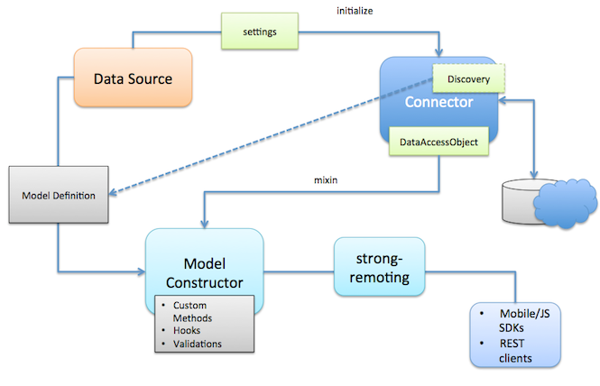

# LoopBack DataSource Juggler

LoopBack DataSource Juggler is an ORM that provides a common set of interfaces for interacting with databases, REST APIs,
and other data sources. It was initially forked from [JugglingDB](https://github.com/1602/jugglingdb).

## Overview

LoopBack DataSource Juggler consists of the following components:

* LoopBack Definition Language
* DataSource
* Connector

## LoopBack Definition Language

To define model dataSource have single method `dataSource.define`. It accepts three
arguments:

* **model name**:
  String name in camel-case with first upper-case letter. This name will be used
  later to access model.
* **properties**:
  Object with property type definitions. Key is property name, value is type
  definition. Type definition can be function representing type of property
  (String, Number, Date, Boolean), or object with {type: String|Number|...,
  index: true|false} format.
* **settings**:
  Object with model-wide settings such as `tableName` or so.

Examples of model definition:

    var User = dataSource.define('User', {
        email: String,
        password: String,
        birthDate: Date,
        activated: Boolean
    });

    var User = dataSource.define('User', {
        email: { type: String, limit: 150, index: true },
        password: { type: String, limit: 50 },
        birthDate: Date,
        registrationDate: {
            type: Date,
            default: function () { return new Date }
        },
        activated: { type: Boolean, default: false }
    }, {
        tableName: 'users'
    });

## DataSource

DataSource is a factory for model classes. DataSource connected with specific database or other
backend system using connector.

All model classes within single datasource shares same connector type and one database
connection. But it's possible to use more than one datasource to connect with
different databases.

### Creating dataSource

`DataSource` constructor available on `loopback-datasource-juggler` module:

    var DataSource = require('loopback-datasource-juggler').DataSource;

DataSource constructor accepts two arguments. First argument is connector. It could be
connector name or connector package:

    var dataSourceByConnectorName = new DataSource('memory');
    var dataSourceByConnectorModule = new DataSource(require('redis'));

### Settings

Second argument is optional settings. Settings object format and defaults
depends on specific connector, but common fields are:

* `host`: Database host
* `port`: Database port
* `username`: Username to connect to database
* `password`: Password to connect to database
* `database`: Database name
* `debug`: Turn on verbose mode to debug db queries and lifecycle

For connector-specific settings refer to connector's readme file.

## LoopBack Connectors

|    Type   | Package Name                                                                           |
| --------- |:--------------------------------------------------------------------------------------:|
| MongoDB   | [loopback-connector-mongodb](https://github.com/strongloop/loopback-connector-mongodb) |
| Oracle    | [loopback-connector-oracle](https://github.com/strongloop/loopback-connector-oracle)   |
| MySQL     | [loopback-connector-mysql](https://github.com/strongloop/loopback-connector-mysql)     |

LoopBack connectors provide access to backend systems including databases, REST APIs
and other services. Connectors are not used directly by application code. We create
a DataSource to interact with the connector.

For example,

    var DataSource = require('loopback-datasource-juggler').DataSource;
    var oracleConnector = require('loopback-connector-oracle');

    var ds = new DataSource(oracleConnector, {
        host : '127.0.0.1',
        database : 'XE',
        username : 'strongloop',
        password : 'password',
        debug : true
    });

The connector argument passed the DataSource constructor can be one of the following:

* The connector module from `require(connectorName)`
* The full name of the connector module, such as 'loopback-connector-oracle'
* The short name of the connector module, such as 'oracle', which will be converted to 'loopback-connector-<shortName>'
* A local module under ./connectors/<connectorName> folder

## Installation

    npm install loopback-datasource-juggler

Also install the appropriated connector, for example for mongodb:

    npm install loopback-connector-mongodb

check following list of available connectors

