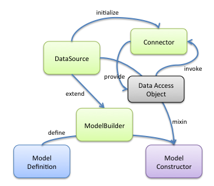

# LoopBack DataSource and Connector Guide

## Overview
LoopBack is centered around models, which represent data and behaviors. The
concept of `DataSource` is introduced to encapsulate business logic to exchange
data between models and various data sources. Data sources are typically
databases that provide create, retrieve, update, and delete (CRUD) functions.
LoopBack also generalize other backend services, such as REST APIs, SOAP Web
Services, and Storage Services, as data sources.

Data sources are backed by connectors which implement the data exchange logic
using database drivers or other client APIs. In general, connectors are not used
directly by application code. The `DataSource` class provides APIs to configure
the underlying connector and exposes functions via `DataSource` or model classes.



The diagram above illustrates the relationship between LoopBack `Model`,
`DataSource`, and `Connector`.

1. Define the Model using [LoopBack Definition Language (LDL)](definition-language.md).
Now we have a model definition in plain JSON or JavaScript object.

2. Create an instance of ModelBuilder or DataSource. Please note that
DataSource extends from ModelBuilder. ModelBuilder is responsible for compiling
model definitions to JavaScript constructors representing model classes.
DataSource inherits that function from ModelBuilder. In addition, DataSource
adds behaviors to model classes by mixing in methods from the DataAccessObject
into the model class.

3. Use ModelBuilder or DataSource to build a JavaScript constructor (i.e,
the model class) from the model definition. Model classes built from ModelBuilder
can be later attached to a DataSource to receive the mixin of data access
functions.

4. As part of step 2, DataSource initializes the underlying Connector with
a settings object which provides configurations to the connector instance.
Connector collaborates with DataSource to define the functions as
DataAccessObject to be mixed into the model class. The DataAccessObject
consists of a list of static and prototype methods. It can be CRUD operations
or other specific functions depending on the connector's capabilities.

## LoopBack DataSource

DataSource is the unified interface for LoopBack applications to integrate with
backend systems. It's a factory for data access logic around model classes. With
the ability to plug in various connectors, DataSource provides the necessary
abstraction to interact with databases or services to decouple the business
logic from plumbing technologies.

### Creating a DataSource

The `DataSource` constructor is available from `loopback-datasource-juggler` module:

    var DataSource = require('loopback-datasource-juggler').DataSource;

`DataSource` constructor accepts two arguments:
- connector: The name or instance of the connector module
- settings: An object of properties to configure the connector


```
var dataSource = new DataSource({
    connector: require('loopback-connector-mongodb'),
    host: 'localhost',
    port: 27017,
    database: 'mydb'
});
```

#### connector

The `connector` argument passed the DataSource constructor can be one of the following:

* The connector module from `require(connectorName)`
* The full name of the connector module, such as 'loopback-connector-oracle'
* The short name of the connector module, such as 'oracle', which will be converted
to 'loopback-connector-<shortName>'
* A local module under ./connectors/<connectorName> folder

```
var ds1 = new DataSource('memory');
var ds2 = new DataSource('loopback-connector-mongodb');
var ds3 = new DataSource(require('loopback-connector-oracle'));
```

**Note**: LoopBack provides a built-in connector named as `memory` to use in-memory
store for CRUD operations.

#### settings

The `settings` argument configures the connector. Settings object format and defaults
depends on specific connector, but common fields are:

* `host`: Database host
* `port`: Database port
* `username`: Username to connect to database
* `password`: Password to connect to database
* `database`: Database name
* `debug`: Turn on verbose mode to debug db queries and lifecycle

For connector-specific settings refer to connector's readme file.

## Creating a Model

`DataSource` extends from `ModelBuilder`, which is a factory for plain model
classes that only have properties. `DataSource` connected with specific databases
or other backend systems using `Connector`.

    var DataSource = require('loopback-datasource-juggler').DataSource;
    var ds = new DataSource('memory');

    var User = ds.define('User', {
        name: String,
        bio: String,
        approved: Boolean,
        joinedAt: Date,
        age: Number
    });

All model classes within single data source shares same connector type and one
database connection or connection pool. But it's possible to use more than one
data source to connect with different databases.

Alternatively, a plain model constructor created from `ModelBuilder` can be
attached a `DataSource`.

    var ModelBuilder = require('loopback-datasource-juggler').ModelBuilder;
    var builder = new ModelBuilder();

    var User = builder.define('User', {
            name: String,
            bio: String,
            approved: Boolean,
            joinedAt: Date,
            age: Number
    });

    var DataSource = require('loopback-datasource-juggler').DataSource;
    var ds = new DataSource('memory');

    User.attachTo(ds); // The CRUD methods will be mixed into the User constructor


## More DataSource Features

In addition to data access functions mixed into the model class, `DataSource`
also provides APIs to interact with the underlying backend system.

### Discovering model definitions from the data source

Some connectors provide discovery capability so that we can use DataSource to
discover model definitions from existing database schema.

The following APIs allow UI or code to discover database schema definitions that
can be used to build LoopBack models.

    // List database tables and/or views
    ds.discoverModelDefinitions({views: true, limit: 20}, cb);

    // List database columns for a given table/view
    ds.discoverModelProperties('PRODUCT', cb);
    ds.discoverModelProperties('INVENTORY_VIEW', {owner: 'STRONGLOOP'}, cb);

    // List primary keys for a given table
    ds.discoverPrimaryKeys('INVENTORY',  cb);

    // List foreign keys for a given table
    ds.discoverForeignKeys('INVENTORY',  cb);

    // List foreign keys that reference the primary key of the given table
    ds.discoverExportedForeignKeys('PRODUCT',  cb);

    // Create a model definition by discovering the given table
    ds.discoverSchema(table, {owner: 'STRONGLOOP'}, cb);

You can also discover and build model classes in one shot:

    // Start with INVENTORY table and follow the primary/foreign relationships to discover associated tables
    ds.discoverAndBuildModels('INVENTORY', {visited: {}, relations: true}, function (err, models) {

        // Now we have an object of models keyed by the model name
        // Find the 1st record for Inventory
        models.Inventory.findOne({}, function (err, inv) {
            if(err) {
                console.error(err);
                return;
            }
            console.log("\nInventory: ", inv);

            // Follow the product relation to get information about the product
            inv.product(function (err, prod) {
                console.log("\nProduct: ", prod);
                console.log("\n ------------- ");
            });
        });
    });

In addition to the asynchronous APIs, `DataSource` also provides the synchronous
ones. Please refer to the DataSource API references.

### Synchronizing model definitions against the data source

DataSource instance have two methods for updating db structure: `automigrate` and
`autoupdate` for relational databases.

The `automigrate` method drop table (if exists) and create it again, `autoupdate`
method generates ALTER TABLE query. Both method accepts an optional array of
model names and a callback function to be called when migration/update done. If
the `models` argument is not present, all models are checked.

In the following example, we create first version of the CustomerTest model, use
`automigrate` to create the database table, redefine the model with second
version, and use `autoupdate` to alter the database table.

    // Create the 1st version of 'CustomerTest'
    ds.createModel(schema_v1.name, schema_v1.properties, schema_v1.options);

    // Create DB table for the model
    ds.automigrate(schema_v1.name, function () {

        // Discover the model properties from DB table
        ds.discoverModelProperties('CUSTOMER_TEST', function (err, props) {
            console.log(props);

            // Redefine the 2nd version of 'CustomerTest'
            ds.createModel(schema_v2.name, schema_v2.properties, schema_v2.options);

            // Alter DB table
            ds.autoupdate(schema_v2.name, function (err, result) {
                ds.discoverModelProperties('CUSTOMER_TEST', function (err, props) {
                    console.log(props);
                });
            });
        });
    });


To check if any db changes required use `isActual` method. It accepts
and a `callback` argument, which receive boolean value depending on db state:

- false if db structure outdated
- true when dataSource and db is in sync


    dataSource.isActual(models, function(err, actual) {
        if (!actual) {
            dataSource.autoupdate(models, function(err, result) {
                ...
            });
        }
    });

## LoopBack Connector

Connectors implement the logic to integrate with specific backend systems, such
as databases or REST services.

### LoopBack Connector Modules

|    Type   | Package Name                                                                           |
| --------- |:--------------------------------------------------------------------------------------:|
| Memory    | [Built-in](https://github.com/strongloop/loopback-datasource-juggler) |
| MongoDB   | [loopback-connector-mongodb](https://github.com/strongloop/loopback-connector-mongodb) |
| Oracle    | [loopback-connector-oracle](https://github.com/strongloop/loopback-connector-oracle)   |
| REST      | [loopback-connector-rest](https://github.com/strongloop/loopback-connector-rest)       |
| MySQL     | [loopback-connector-mysql](https://github.com/strongloop/loopback-connector-mysql)     |


### Interaction between DataSource and Connector

#### Initializing connector

The connector module can export an `initialize` function to be called by the
owning DataSource instance.

    exports.initialize = function (dataSource, postInit) {

        var settings = dataSource.settings || {}; // The settings is passed in from the dataSource

        var connector = new MyConnector(settings); // Construct the connector instance
        dataSource.connector = connector; // Attach connector to dataSource
        connector.dataSource = dataSource; // Hold a reference to dataSource
        ...
    };

The DataSource calls the `initialize` method with itself and an optional `postInit`
callback function. The connector receives the settings from the `dataSource`
argument and use it to configure connections to backend systems.

Please note connector and dataSource set up a reference to each other.

Upon initialization, the connector might connect to database automatically.
Once connection established dataSource object emit 'connected' event, and set
`connected` flag to true, but it is not necessary to wait for 'connected' event
because all queries cached and executed when dataSource emit 'connected' event.

To disconnect from database server call `dataSource.disconnect` method. This
call is forwarded to the connector if the connector have ability to connect/disconnect.

#### Accessing data/services

The connector instance can have an optional property named as DataAccessObject
that provides static and prototype methods to be mixed into the model constructor.
DataSource has a built-in DataAccessObject to support CRUD operations. The
connector can choose to use the CRUD DataAccessObject or define its own.

When a method is invoked from the model class or instance, it's delegated to the
DataAccessObject which is backed by the connector.

For example,

    User.create() --> dataSource.connector.create() --> Oracle.prototype.create()

## Building your own connectors

LoopBack connectors provide access to backend systems including databases, REST
APIs and other services. Connectors are not used directly by application code.
We create a DataSource to interact with the connector.

For example,

    var DataSource = require('loopback-datasource-juggler').DataSource;
    var oracleConnector = require('loopback-connector-oracle');

    var ds = new DataSource(oracleConnector, {
        host : 'localhost',
        database : 'XE',
        username : 'username',
        password : 'password',
        debug : true
    });


### Implementing a generic connector

A connector module can implement the following methods to interact with the data
source.

    exports.initialize = function (dataSource, postInit) {

        var settings = dataSource.settings || {}; // The settings is passed in from the dataSource

        var connector = new MyConnector(settings); // Construct the connector instance
        dataSource.connector = connector; // Attach connector to dataSource
        connector.dataSource = dataSource; // Hold a reference to dataSource

        /**
         * Connector instance can have an optional property named as DataAccessObject that provides
         * static and prototype methods to be mixed into the model constructor. The property can be defined
         * on the prototype.
         */
        connector.DataAccessObject = function {};

        /**
         * Connector instance can have an optional function to be called to handle data model definitions.
         * The function can be defined on the prototype too.
         * @param model The name of the model
         * @param properties An object for property definitions keyed by propery names
         * @param settings An object for the model settings
         */
        connector.define = function(model, properties, settings) {
            ...
        };

        connector.connect(..., postInit); // Run some async code for initialization
        // process.nextTick(postInit);
    }

Another way is to directly export the connection function which takes a settings object.

    module.exports = function(settings) {
        ...
    }

### Implementing a CRUD connector

To support CRUD operations for a model class that is attached to the
dataSource/connector, the connector needs to provide the following functions:

    /**
     * Create a new model instance
     */
    CRUDConnector.prototype.create = function (model, data, callback) {
    };

    /**
     * Save a model instance
     */
    CRUDConnector.prototype.save = function (model, data, callback) {
    };

    /**
     * Check if a model instance exists by id
     */
    CRUDConnector.prototype.exists = function (model, id, callback) {
    };

    /**
     * Find a model instance by id
     */
    CRUDConnector.prototype.find = function find(model, id, callback) {
    };

    /**
     * Update a model instance or create a new model instance if it doesn't exist
     */
    CRUDConnector.prototype.updateOrCreate = function updateOrCreate(model, data, callback) {
    };

    /**
     * Delete a model instance by id
     */
    CRUDConnector.prototype.destroy = function destroy(model, id, callback) {
    };

    /**
     * Query model instances by the filter
     */
    CRUDConnector.prototype.all = function all(model, filter, callback) {
    };

    /**
     * Delete all model instances
     */
    CRUDConnector.prototype.destroyAll = function destroyAll(model, callback) {
    };

    /**
     * Count the model instances by the where criteria
     */
    CRUDConnector.prototype.count = function count(model, callback, where) {
    };

    /**
     * Update the attributes for a model instance by id
     */
    CRUDConnector.prototype.updateAttributes = function updateAttrs(model, id, data, callback) {
    };


