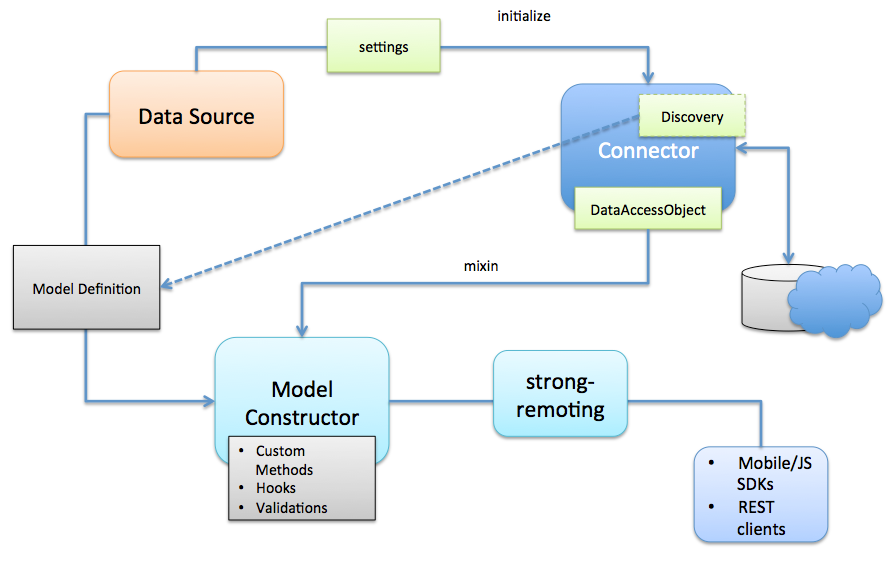

# loopback-data

Loopback-data provides ORM and data connectivity for Node.js. It was initially forked from [JugglingDB](https://github.com/1602/jugglingdb).

## Overview

## SEE ALSO

loopback-data-connector
